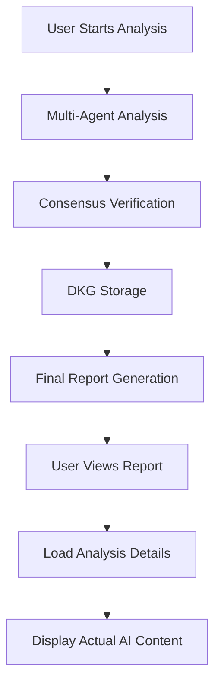

# Final Analysis Report - Technical Implementation Guide

## Overview

The Final Analysis Report is a comprehensive end-to-end feature that displays detailed investment analysis results after multi-agent AI analysis completion. It provides users with actionable insights, consensus verification, and professional reporting capabilities.

## Architecture Components

### 1. Core Component Structure

```typescript
// Main Component: src/components/FinalReport.tsx
interface FinalReportProps {
  analysisResult: AnalysisResult;      // Task execution results
  consensusData: ConsensusData[];      // Verification and consensus data
  systemMetrics: SystemMetrics;        // DKG and reputation metrics
  symbol: string;                      // Analyzed symbol (BTC, AAPL, etc.)
  onClose: () => void;                 // Close handler
}
```

### 2. Data Flow Architecture



## Key Technical Features

### 1. Dynamic Content Extraction

The system extracts actual AI analysis content from DKG nodes:

```typescript
const extractActualAnalysisContent = (resultData: any, componentType: string) => {
  switch (componentType) {
    case 'sentiment':
      return {
        sentiment: resultData.sentiment || 'Neutral',
        confidence: resultData.confidence || 0,
        trends: resultData.analysis?.trends || [],
        riskFactors: resultData.riskAssessment?.riskFactors || [],
        strategy: resultData.recommendations?.strategy,
        summary: resultData.analysis?.news_summary
      };
    case 'technical':
      return {
        signalProbability: resultData.signalProbability || 0,
        priceTargets: resultData.priceTargets || {},
        tradingSignals: resultData.buySignals?.slice(0, 3) || [],
        riskParameters: resultData.riskParameters || {},
        confidenceLevel: resultData.confidenceLevel || 0
      };
    // ... other component types
  }
};
```

### 2. Multi-Tab Interface

Five specialized tabs provide different perspectives:

- **💡 Analysis Insights** (Default): Actual AI analysis content
- **📋 Summary**: Executive overview and metrics
- **✅ Consensus**: Verification results and scores
- **📈 Performance**: Cost, timing, and quality metrics
- **🤖 Agents**: Agent rankings and specialties

### 3. Real-Time Data Loading

```typescript
const fetchDKGDetails = async () => {
  setLoadingDetails(true);
  try {
    const response = await fetch(`/api/dkg/nodes?taskId=${analysisResult.taskId}`);
    const data = await response.json();
    if (data.success) {
      setDkgNodes(data.nodes);
    }
  } catch (error) {
    console.error('Failed to fetch DKG details:', error);
  } finally {
    setLoadingDetails(false);
  }
};
```

## Implementation Details

### 1. Component State Management

```typescript
const [activeTab, setActiveTab] = useState<'insights' | 'summary' | 'consensus' | 'performance' | 'agents'>('insights');
const [dkgNodes, setDkgNodes] = useState<DKGNode[]>([]);
const [loadingDetails, setLoadingDetails] = useState(false);
```

### 2. Analysis Quality Assessment

```typescript
const getOverallStatus = () => {
  const totalComponents = Object.keys(analysisResult.results).length;
  const passedComponents = Object.values(analysisResult.results).filter(r => r.consensus).length;
  const successRate = (passedComponents / totalComponents) * 100;
  
  return {
    status: successRate >= 75 ? 'Excellent' : successRate >= 50 ? 'Good' : 'Needs Review',
    color: successRate >= 75 ? 'bg-green-100 text-green-800' : 'bg-yellow-100 text-yellow-800',
    rate: successRate
  };
};
```

### 3. Metrics Calculation

```typescript
const getTotalCost = () => consensusData.reduce((sum, data) => sum + data.realDataMetrics.apiCost, 0);
const getTotalDuration = () => consensusData.reduce((sum, data) => sum + data.realDataMetrics.duration, 0);
const getAverageConfidence = () => {
  const validConfidences = consensusData.filter(d => d.realDataMetrics.openaiConfidence > 0);
  return validConfidences.reduce((sum, d) => sum + d.realDataMetrics.openaiConfidence, 0) / validConfidences.length;
};
```

## Integration Points

### 1. Main Demo Component Integration

```typescript
// src/components/ChaosChainDemo.tsx
const [showFinalReport, setShowFinalReport] = useState(false);

// Auto-show after analysis completion
setTimeout(() => {
  setShowFinalReport(true);
}, 2000);

// Manual trigger button
<Button onClick={() => setShowFinalReport(true)}>
  📊 View Final Report
</Button>

// Component rendering
{showFinalReport && analysisResult && systemMetrics && (
  <FinalReport
    analysisResult={analysisResult}
    consensusData={consensusData}
    systemMetrics={systemMetrics}
    symbol={selectedSymbol}
    onClose={() => setShowFinalReport(false)}
  />
)}
```

### 2. Backend API Dependencies

- **`/api/comprehensive-analysis`**: Main analysis endpoint
- **`/api/dkg/nodes?taskId=X`**: DKG node retrieval for detailed content

### 3. Data Structure Requirements

```typescript
interface ConsensusData {
  taskId: string;
  componentType: 'sentiment' | 'technical' | 'macro' | 'insights';
  nodeId: string;
  agentId: string;
  consensusReached: boolean;
  averageScore: number;
  passedCount: number;
  totalVerifiers: number;
  realDataMetrics: {
    tokenCount: number;
    apiCost: number;
    duration: number;
    contentQuality: string;
    openaiConfidence: number;
  };
}
```

## UI/UX Design Patterns

### 1. Progressive Disclosure

- Initial view shows summary metrics
- "Load Analysis Details" button reveals actual AI content
- Tabbed interface organizes information by concern

### 2. Visual Hierarchy

```typescript
// Status-based color coding
const getBadgeColor = (consensus: boolean) => 
  consensus ? 'bg-green-100 text-green-800' : 'bg-red-100 text-red-800';

// Component-specific icons and colors
const getComponentIcon = (type: string) => ({
  sentiment: '📈',
  technical: '📊', 
  macro: '🌍',
  insights: '💡'
});
```

### 3. Responsive Layout

- Grid layouts adapt from 1 column (mobile) to 4 columns (desktop)
- Modal overlay with max-width constraints
- Scrollable content areas with fixed header/footer

## Performance Considerations

### 1. Lazy Loading

- DKG nodes loaded on demand via "Load Analysis Details"
- Prevents initial render blocking
- Reduces memory footprint

### 2. Data Optimization

- Only consensus-verified content displayed prominently
- Failed consensus agents shown but de-emphasized
- Metrics calculated once and cached

### 3. Memory Management

```typescript
// Clean component unmounting
useEffect(() => {
  return () => {
    setDkgNodes([]);
    setLoadingDetails(false);
  };
}, []);
```

## Error Handling

### 1. API Failures

```typescript
try {
  const response = await fetch(`/api/dkg/nodes?taskId=${analysisResult.taskId}`);
  const data = await response.json();
  if (data.success) {
    setDkgNodes(data.nodes);
  }
} catch (error) {
  console.error('Failed to fetch DKG details:', error);
  // Graceful degradation - show summary without details
}
```

### 2. Missing Data Handling

```typescript
// Safe property access with fallbacks
const analysis = {
  sentiment: resultData.sentiment || resultData.analysis?.sentiment || 'Neutral',
  confidence: resultData.confidence || resultData.analysis?.confidence || 0,
  trends: resultData.analysis?.trends || []
};
```

## Testing Strategy

### 1. Unit Tests

- Component rendering with different data states
- Calculation functions (costs, durations, confidence)
- Error boundary behavior

### 2. Integration Tests

- API data fetching and state updates
- Tab navigation and content switching
- Modal open/close behavior

### 3. E2E Tests

- Complete analysis workflow → report generation
- Real DKG data loading and display
- Export functionality

## Deployment Considerations

### 1. Environment Variables

- API endpoints configurable
- Feature flags for different report sections
- Debug mode for development

### 2. Performance Monitoring

- Track report load times
- Monitor API response times
- User engagement metrics per tab

### 3. Accessibility

- Keyboard navigation support
- Screen reader compatibility
- Color contrast compliance
- Focus management in modal

## Future Enhancements

### 1. Export Capabilities

- PDF generation with actual analysis content
- CSV export for numerical data
- Email sharing functionality

### 2. Customization

- User-selectable report sections
- Configurable confidence thresholds
- Custom branding options

### 3. Real-time Updates

- WebSocket integration for live updates
- Streaming analysis results
- Progressive report building

## Security Considerations

### 1. Data Validation

- Sanitize all user inputs
- Validate API responses
- Type checking for all data structures

### 2. Access Control

- Task ID validation
- User session verification
- Rate limiting on API endpoints

### 3. Data Privacy

- No sensitive data in client storage
- Secure API communication (HTTPS)
- Audit trail for data access 